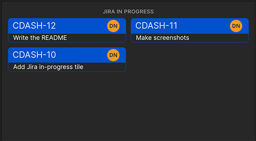

# An easy overview of Jira in progress

[](https://packagist.org/packages/creacoon/laravel-dashboard-jira-tile)
[](https://github.com/creacoon/laravel-dashboard-jira-tile/actions?query=workflow%3Arun-tests+branch%3Amaster)
[](https://packagist.org/packages/creacoon/laravel-dashboard-jira-tile)

This tile shows all the in progress Jira stories. It shows the story key, story title and the assignee profile image.

This tile can be used on the [Laravel Dashboard](https://docs.spatie.be/laravel-dashboard).

## Screenshots
<br />

# Installation
1. Require package via composer
2. Place the required values in the `.env` file.
3. Place the tile component in your dashboard.
4. Schedule the command in the `app/console/kernel.php`

## Composer
You can install the package via composer:

```bash
composer require creacoon/laravel-dashboard-jira-tile
```

## Env file
Place this in the `.env` file.
```dotenv
JIRA_HOST=
JIRA_AUTHENTICATION="basic_token"
JIRA_USER=
JIRA_API_TOKEN=
```

## Tile component

In your dashboard view you use the `livewire:jira-tile` component.

```html
<x-dashboard>
    <livewire:jira-tile position="a2" refresh-interval="60"/>
</x-dashboard>
```

## Schedule command
In `app\Console\Kernel.php` you should schedule the following commands.
```php
protected function schedule(Schedule $schedule)
{
    // ...
           $schedule->command(FetchDataFromHelpscoutCommand::class)->everyFiveMinutes();
}
```

## Customizing the view
If you want to customize the view used to render this tile, run this command:
```bash
php artisan vendor:publish --tag="dashboard-jira-tile-views"
```

## Testing

``` bash
composer test
```

## Changelog

Please see [CHANGELOG](CHANGELOG.md) for more information on what has changed recently.

## Contributing

Please see [CONTRIBUTING](CONTRIBUTING.md) for details.

## Security

If you discover any security related issues, please email support@creacoon.nl instead of using the issue tracker.

## Credits
- [Dion Nijssen](https://github.com/dion213)
- [All Contributors](../../contributors)

## License

The MIT License (MIT). Please see [License File](LICENSE.md) for more information.
